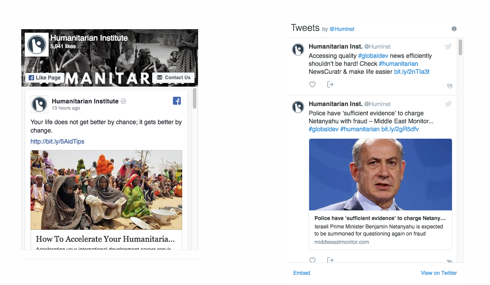
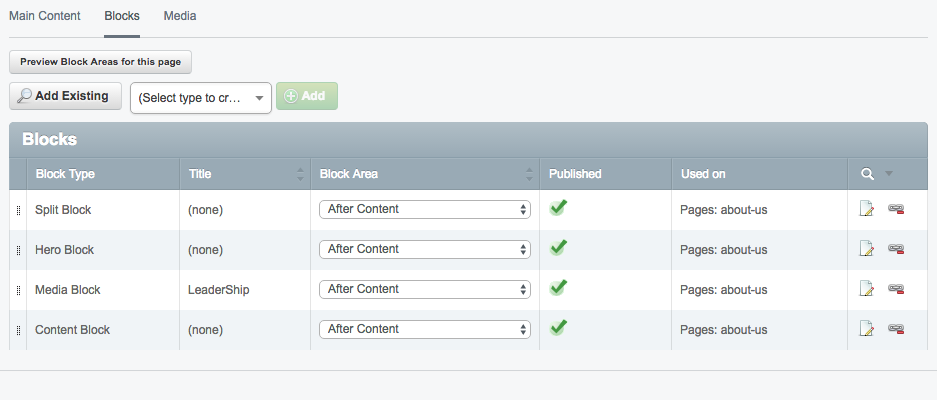
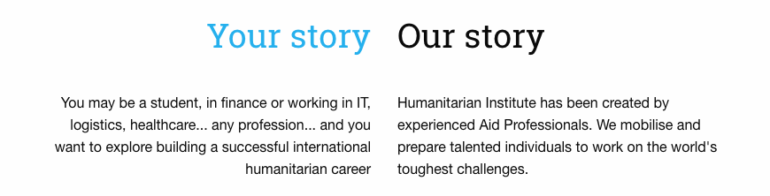
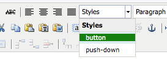

# Silverstripe-Enhancements

A set of CMS enhancements for the Silverstripe platform.  Currently it is an internal Kindleman tool, soon to be released as open source.

Along with this guide, there are [good docs for Silverstripe](https://userhelp.silverstripe.org/en/3.6/) users

Shortcodes
----------------
Includes Social Embeds.  You can use them to place social feeds in your WYSIWYG content areas.

https://github.com/asecondwill/silverstripe-social-embed-shortcodes

Blocks
---------------
Pages have a tab "Blocks".  Click into that and view the dropdown of block types.  Select one and click add to start creating. Click the preview button to see where the blocks will go.

]

Blocks can be ordered using the drag handle on the left.

## Block Types

### Block Grid Block
Creates a block grid using Foundation's blockgrids.  specificy blocks per row for each breakpoint Large, Medium, Small.  Block grids will flow into multiple rows.  

Options -
  expanded row - full width of the browser window, breaking out of the site row limit.

  Collapsed  - Collapses the gutter between blocks.

Once the block is saved, a tab appears to add "Squares" which represents each block.

Add Squares in the order they should be displayed. Use the extraclasses field with the colorscheme classes listed below to provide a background color.

### Hero Block
Hero blocks display WYSIWYG over a hero image , background color or video.

### Posts Block
Displays a block of Blog posts.  

### Split Block
Split block shows two WYSIWYG areas side by side with Right align - left Align formating.  Quite a specific block.

## Two Column Block
Displays WYSIWYG / Images side by side.  Color either side using color scheme extraclasses.

### Content Block
Straightforward WYSIWYG / TINYMCE field.   

Classes
----------------
You can add some special classes to elements to add styling.  

Push-down - adds margin top
Button - turns a link into a button

## Color Scheme classes

* color-scheme-alt-1 white on light blue
* color-scheme-alt-2 white on light grey
* color-scheme-alt-3 white on green
* color-scheme-alt-4 white on  pink;
* color-scheme-alt-5 white on  blue
* color-scheme-alt-6 white on  navy
* color-scheme-alt-7 white on  black
* color-scheme-alt-8 white on  dark grey
* color-scheme-alt-9 white on  orange

Sass Framework
----------------
The Css is based on the Sass framework Foundation.  The docs for foundation are useful when using the blocks components or developting new themes.   The blocks module aims to provide various foundation elements as flexible content.   

http://foundation.zurb.com/sites/docs/

Forms
-----------------
Includes Silverstripe's userforms module.  To add a form,  create a page of type UserDefinedForms.  Click the FormFields tab and add fields. There is [Further UserForms documentation](https://github.com/silverstripe/silverstripe-userforms/blob/master/docs/en/userguide/index.md) available.

